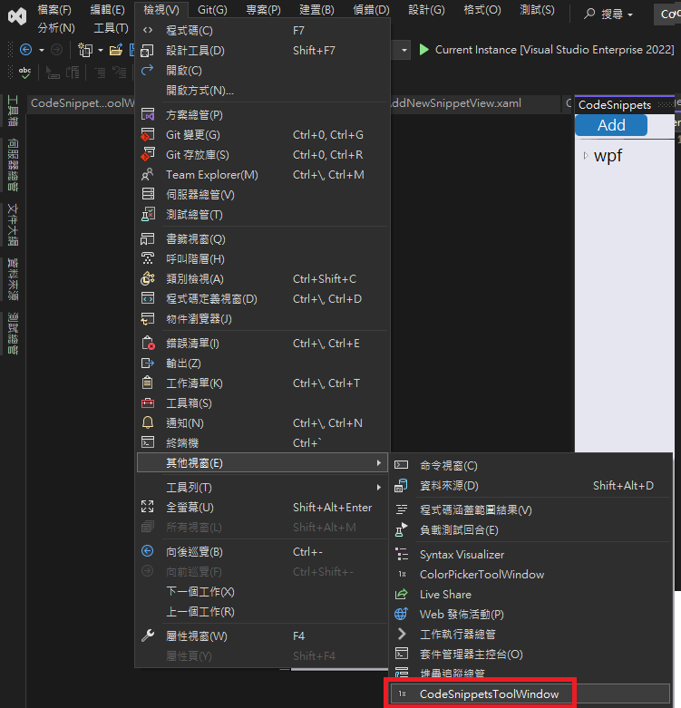
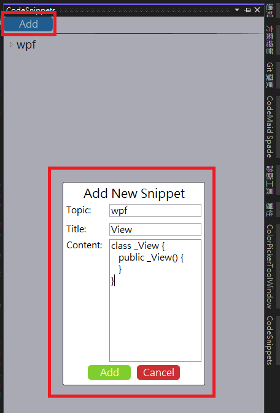
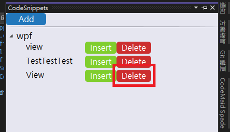

# CodeSnippets
使用樹狀結構列出定義好的 Code Snippets
在樹狀結構中，可將滑鼠停在標題上，會顯示出內容

## 開啟延伸工具
檢視 -> 其他視窗 -> CodeSnippetsToolWindow

## 如何使用
### 新增 Topic
輸入主題之後，給定項目名稱與內容，會自動新增到指定的 Topic 中

### 刪除項目
點選項目旁邊的刪除按鈕即可進行刪除

## 移除延伸工具
移除專案之後記得刪掉在 %APPDATA%\CodeSnippets 資料夾